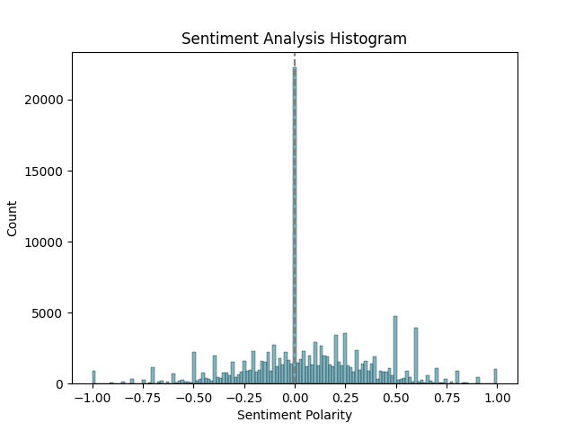

# Sentiment Analysis of Tweets using TextBlob
This repository contains a Python script that performs sentiment analysis on tweets using the TextBlob library. The script reads data from a CSV file, applies sentiment analysis to the text of each tweet, and visualizes the results using the Seaborn library.

## Requirements

* Python 3.x
* pandas
* matplotlib
* seaborn
* textblob

You can install the required libraries using pip:
```
pip install pandas matplotlib seaborn textblob
```
## Usage
To use the script, follow these steps:

# Prepare a CSV file with a column named text containing the text of the tweets you want to analyze.
Run the script using the following command:

```
python sentiment_analysis.py <path-to-csv-file>
```
Replace <path-to-csv-file> with the actual path to your CSV file.


# The script will output a markdown table containing the sentiment analysis results, as well as a histogram showing the distribution of sentiment scores.
Example
Here's an example of how to use the script:

Suppose you have a CSV file named tweets.csv with the following content:

text
I love this product
This is a terrible product
I am happy with my purchase
I will never buy this again
This is the best thing I have ever bought

You can run the script using the following command:

```
python sentiment_analysis.py tweets.csv
```

The script will output the following markdown table:

text                                        |  polarity   |              subjectivity           |	sentiment
I love this product	                             0.6	                        0.6	                        1
This is a terrible product	                    -0.6	                        0.6	                        0
I am happy with my purchase	                     0.6	                        0.4	                        1
I will never buy this again	                    -0.6	                        0.6                         0
This is the best thing I have ever bought	     0.8	                        0.2	                        1

And the following histogram:

# Sentiment Analysis Histogram



The histogram shows the distribution of sentiment scores, with positive scores (1) on the right and negative scores (0) on the left. In this example, most of the tweets have a positive sentiment, with a few having a negative sentiment.

